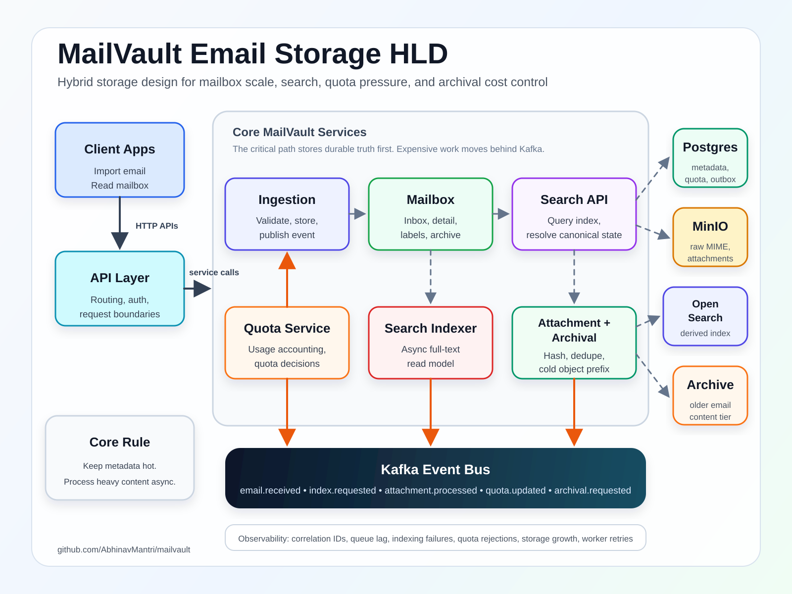

# MailVault

Scalable email storage, search, and archival system designed to explore the real storage pressure behind large mailbox platforms.

MailVault is not a Gmail clone. It focuses on the backend architecture required to ingest email, separate metadata from large content, deduplicate attachments, enforce storage quotas, index messages for search, and move old data into cheaper archival storage.

## Problem

Email storage grows continuously because users rarely delete mail, attachments are duplicated across many accounts, search indexes require their own storage, and cloud providers must replicate and back up data for durability.

The goal of MailVault is to demonstrate a production-minded design for this problem:

- Store mailbox metadata in a relational database.
- Store raw MIME messages and attachments in object storage.
- Deduplicate attachments by content hash.
- Process indexing, scanning, quota updates, and archival asynchronously.
- Keep search as a derived read model, not the source of truth.
- Make storage usage and failure modes observable.

## Target Architecture

Editable Draw.io source: [`docs/architecture.drawio`](docs/architecture.drawio)

## MVP Scope

- Import email through an API.
- Store email metadata in Postgres.
- Store raw content and attachments in MinIO.
- Publish email events to Kafka.
- Index searchable fields in OpenSearch.
- Search by sender, recipient, subject, body, date, and labels.
- Track per-user storage quota.
- Deduplicate attachments using SHA-256 hashes.
- Run the full stack locally with Docker Compose.

## Planned Services

| Service | Responsibility |
| --- | --- |
| `ingestion-service` | Accept email imports, persist metadata, store raw content, publish events |
| `mailbox-service` | Serve inbox, message detail, labels, archive, delete, and search APIs |
| `search-indexer` | Consume indexing events and update OpenSearch |
| `attachment-worker` | Extract attachment metadata, compute content hashes, and support deduplication |
| `quota-service` | Track user storage usage and enforce quota decisions |
| `archival-worker` | Move old email content to archival object-storage prefixes |

## Engineering Themes

- Hybrid storage design
- Event-driven processing
- Idempotent ingestion
- Attachment deduplication
- Search-index consistency
- Quota enforcement
- Lifecycle and archival policies
- Operational observability

## Status

Planning and scaffolding phase.
