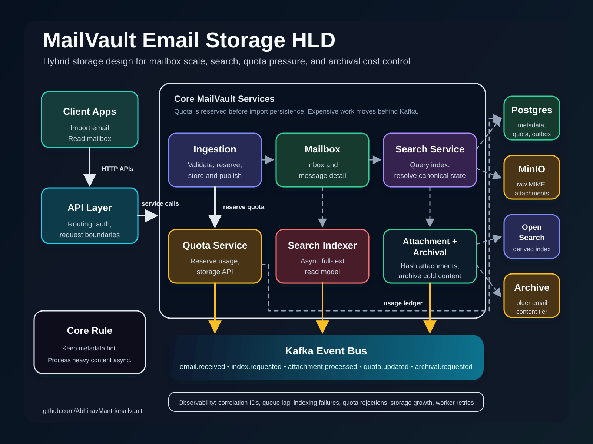

# MailVault

Scalable email storage, search, and archival system designed to explore the real storage pressure behind large mailbox platforms.

MailVault is not a Gmail clone. It focuses on the backend architecture required to ingest email, separate metadata from large content, deduplicate attachments, enforce storage quotas, index messages for search, and move old data into cheaper archival storage.

## Problem

Email storage grows continuously because users rarely delete mail, attachments are duplicated across many accounts, search indexes require their own storage, and cloud providers must replicate and back up data for durability.

The goal of MailVault is to demonstrate a production-minded design for this problem:

- Store mailbox metadata in a relational database.
- Store raw MIME messages and attachments in object storage.
- Deduplicate attachments by content hash.
- Process indexing, scanning, quota updates, and archival asynchronously.
- Keep search as a derived read model, not the source of truth.
- Make storage usage and failure modes observable.

## Target Architecture



Editable Draw.io source: [`docs/architecture.drawio`](docs/architecture.drawio)

Focused diagrams:

- [Business Use Cases](docs/diagrams/business-use-cases.svg)
- [Attachment Security Flow](docs/diagrams/attachment-security-flow.svg)
- [Storage Lifecycle Flow](docs/diagrams/storage-lifecycle-flow.svg)

Architecture notes:

- [Outbox and CDC Strategy](docs/outbox-cdc.md)

## MVP Scope

- Import email through an API. _Implemented in `ingestion-service`._
- Read inbox and email detail through APIs. _Implemented in `mailbox-service`._
- Store email metadata in Postgres. _Initial schema added._
- Store raw content and attachments in MinIO. _Implemented with direct attachment upload URLs._
- Publish email events through a transactional outbox. _Implemented for `email.received`._
- Index searchable fields in OpenSearch. _Initial async `search-indexer` added for event fields._
- Search by sender, recipient, subject, and received date. _Initial `search-service` added; body and labels are planned._
- Track per-user storage quota. _Initial quota reservation and storage usage APIs added in `quota-service`._
- Deduplicate attachments using SHA-256 hashes. _Initial canonical blob dedupe is implemented in `attachment-worker`._
- Run the full stack locally with Docker Compose. _Infrastructure Compose file added._

## Local Development

Start the local infrastructure:

```bash
docker compose up -d
```

Run the quota service:

```bash
cd quota-service
mvn spring-boot:run
```

Run the ingestion service in another terminal:

```bash
cd ingestion-service
mvn spring-boot:run
```

Run the mailbox service in another terminal:

```bash
cd mailbox-service
mvn spring-boot:run
```

Run the search indexer in another terminal:

```bash
cd search-indexer
mvn spring-boot:run
```

Run the search service in another terminal:

```bash
cd search-service
mvn spring-boot:run
```

Run the attachment worker in another terminal:

```bash
cd attachment-worker
mvn spring-boot:run
```

Initiate an attachment upload:

```bash
curl -X POST http://localhost:8081/attachments/initiate \
  -H "Content-Type: application/json" \
  -d '{
    "userId": "user-123",
    "filename": "invoice.txt",
    "contentType": "text/plain",
    "sizeBytes": 15
  }'
```

Upload the file directly to the returned `uploadUrl`, then complete it:

```bash
curl -X POST http://localhost:8081/attachments/{attachmentId}/complete
```

Import a sample email using uploaded attachment IDs:

```bash
curl -X POST http://localhost:8081/emails/import \
  -H "Content-Type: application/json" \
  -d '{
    "userId": "user-123",
    "from": "billing@example.com",
    "to": ["abhinav@example.com"],
    "subject": "Invoice for May",
    "textBody": "Invoice attached.",
    "htmlBody": "<p>Invoice attached.</p>",
    "attachmentIds": ["00000000-0000-0000-0000-000000000000"]
  }'
```

Local endpoints:

| Component | URL |
| --- | --- |
| Ingestion service | `http://localhost:8081` |
| Mailbox service | `http://localhost:8082` |
| Quota service | `http://localhost:8083` |
| Search indexer | `http://localhost:8084` |
| Search service | `http://localhost:8085` |
| Attachment worker | `http://localhost:8086` |
| MinIO console | `http://localhost:9001` |
| OpenSearch | `http://localhost:9200` |
| Postgres | `localhost:5432` |
| Kafka | `localhost:9092` |

## Production Hardening Roadmap

- Add asynchronous antivirus scanning for attachments.
- Block attachment downloads until a clean scan verdict exists.
- Quarantine infected attachments and exclude them from download paths.
- Add retry, timeout, and alerting behavior for scan failures.

## Planned Services

| Service | Responsibility |
| --- | --- |
| `ingestion-service` | Accept email imports, persist metadata, store raw content, write outbox events |
| `mailbox-service` | Serve inbox and message detail read APIs |
| `quota-service` | Reserve quota, track logical storage usage, and serve storage usage APIs |
| `search-indexer` | Consume email events and update OpenSearch |
| `search-service` | Serve user search queries from OpenSearch |
| `attachment-worker` | Compute attachment hashes and prepare dedupe metadata |
| `attachment-scanner` | Scan attachments asynchronously and record clean, infected, or failed verdicts |
| `archival-worker` | Move old email content to archival object-storage prefixes |

## Engineering Themes

- Hybrid storage design
- Event-driven processing
- Idempotent ingestion
- Attachment deduplication
- Search-index consistency
- Quota enforcement
- Lifecycle and archival policies
- Operational observability

## Status

Phase 1 foundation in progress. The repository now includes local infrastructure plus the first write-side and read-side services.

Implemented so far:

- Docker Compose infrastructure for Postgres, Kafka, MinIO, and OpenSearch
- Spring Boot `ingestion-service`
- Spring Boot `mailbox-service`
- Spring Boot `quota-service`
- Spring Boot `search-indexer`
- Spring Boot `search-service`
- Spring Boot `attachment-worker`
- `POST /attachments/initiate` for presigned upload URLs
- `POST /attachments/{attachmentId}/complete`
- `POST /emails/import`
- `POST /quota/reservations`
- `GET /mailboxes/{userId}/inbox`
- `GET /emails/{emailId}?userId={userId}`
- `GET /users/{userId}/storage` from `quota-service`
- `GET /emails/search?userId={userId}&q={query}` from `search-service`
- Kafka consumer for `email.received` in `search-indexer`
- OpenSearch document upsert for indexed email fields
- scheduled attachment worker for SHA-256 hash processing
- Flyway schema for emails, recipients, attachments, attachment references, storage usage, and outbox events
- MinIO object writes for raw email/body and direct attachment uploads
- uploaded attachment references on email import
- Transactional outbox publication for Kafka `email.received` events
- Actuator health endpoint
